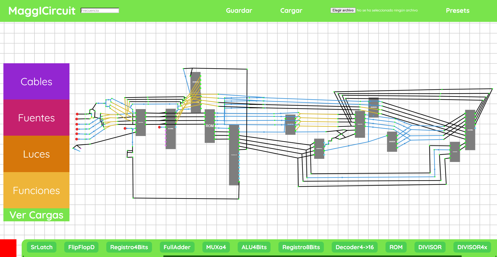
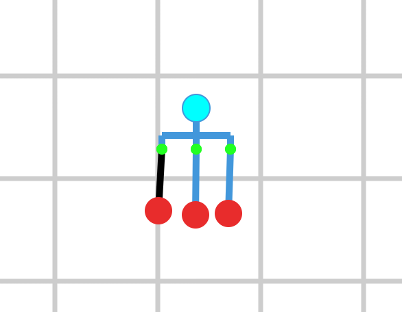
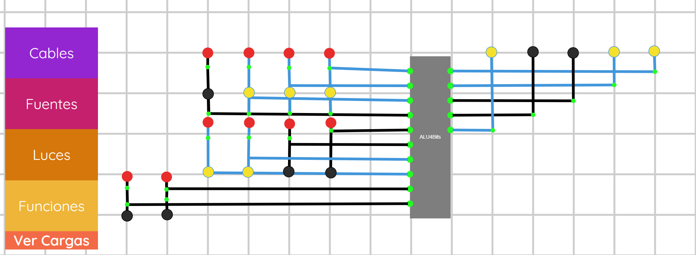
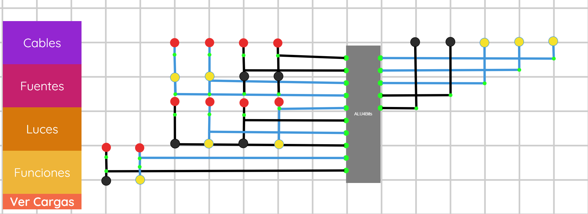
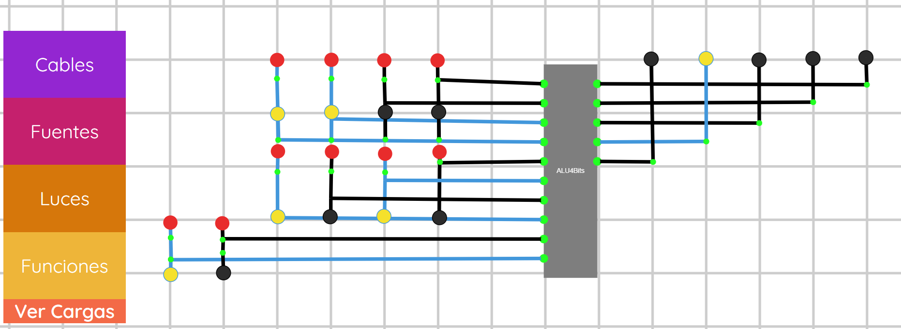
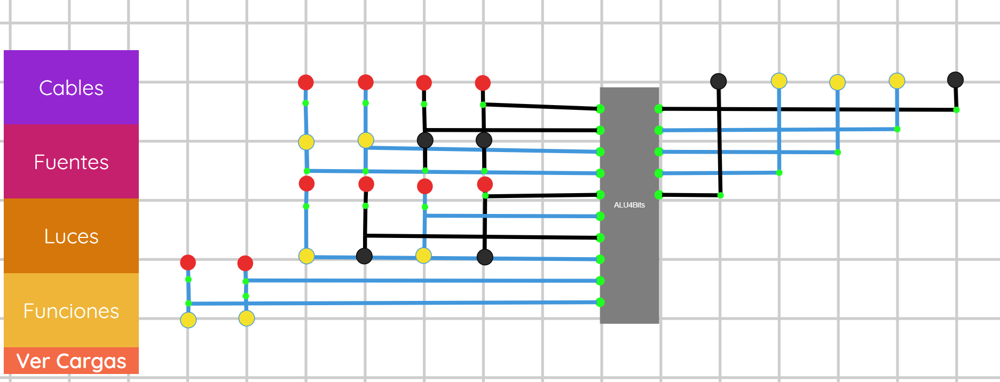
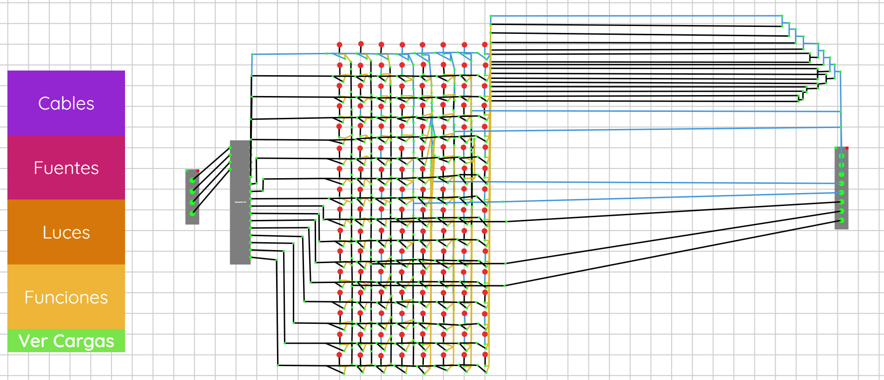

# MaggICircuit V0.1



**MaggICircuit (MIC)** es un simulador de circuitos digitales (corriente eléctrica) desarrollado desde cero en **HTML, CSS y JavaScript** pensado para usarlo como aprendizaje de bajo nivel sin aplicaciones técnicas.

El proyecto permite construir circuitos digitales de forma visual utilizando **compuertas lógicas, cables, interruptores, botones, LEDs RGB y fuentes periódicas**, además de permitir crear bloques reutilizables y circuitos más complejos a partir de componentes más simples.

El objetivo es poder experimentar con lógica digital y construir sistemas cada vez más complejos, llegando desde simples compuertas hasta componentes como **sumadores, registros, contadores, multiplexores, ALU de 4 bits, Semaforos**, etc.

---

# 📐 Editor

MIC incluye herramientas para facilitar la navegación y edición de circuitos grandes.

Entre ellas:

* Zoom. (ruedita del mouse)
* Desplazamiento. (apretando la ruedita del mouse)
* Área de trabajo extensa.
* Conexión mediante cables.
* Componentes visuales.
* Visualización de estados.
* Modos de simulación.
* Edición de frecuencia.
* Bloques reutilizables.

Esto permite pasar de circuitos pequeños a proyectos mucho más grandes sin tener que abandonar el mismo entorno.

El editor esta optimizado para crear grandes circuitos (no pesar mucho en el guardado) y funcionar optimizado.

Los componentes que no ves no se renderizan y está separado lógicamente cada función y la manera en la que se propaga para un mejor rendimiento.

---

## ✨ Características

* Editor visual de circuitos digitales.
* Colocación y conexión de componentes mediante cables.
* Compuertas lógicas.
* Interruptores y botones.
* LEDs y LEDs RGB.
* Fuentes de señal periódicas.
* Simulación del estado de las señales dentro del circuito.
* Sistema de carga y guardado de circuitos.
* Archivos de proyecto con extensión `.icircuit`.
* Zoom y desplazamiento del área de trabajo.
* Diferentes niveles de simulación.
* Modo **VerCargas** para visualizar como se movería la electricidad dentro del circuito.
* Sistema de bloques reutilizables.
* Posibilidad de crear funciones/circuitos personalizados.
* Editor de frecuencia para fuentes periódicas.
* Construcción de circuitos digitales complejos a partir de componentes básicos.
* Soporte para circuitos de gran tamaño.
* Simulación de decenas de miles de cables manteniendo una interacción fluida.

---

## 🖥️ Interfaz

La aplicación presenta un espacio de trabajo donde se pueden colocar componentes y conectarlos mediante cables.

A la izquierda puedes abrir diferentes secciones que al tocar una de sus opciones creará un cable en el centro de tu pantalla.

Los componentes pueden utilizarse como bloques básicos para construir sistemas progresivamente más complejos.

Todos los componentes incluyen una entrada (violeta) o una salida (azul), siempre las azules se conectan con violetas.

Dentro de la sección cables tienes:
* Cable común: conectar una entrada con salida y viceversa.
* Cable 2 salidas: permite partir la señal y distribuirla en un tiempo. (si quieres partir más señales en un tiempo debes hacer una función).
* Cable 2 entradas: un cable or común y corriente, si recibe señal en una de las dos entradas la transmite a su salida.
* Cable 2 entradas (amarillo): un cable and, solo si recibe corriente de ambas entradas se encenderá.

Dentro de la sección luces tienes una luz común de una entrada y otra RGB de 3 entradas las cuales puedes combinar para conseguir colores.


Dentro de la sección fuentes hay 2, una roja que se activa como switch y una naranja que solo se enciende al mantenerla clickeada.

Dentro de la sección funciones aparecerán las funciones que hagas.

Debajo se encuentran las funciones las cuales puedes crear, renombrar haciendo doble click o eliminar con click derecho.

Dentro de las funciones (no main) puedes editar cuantas entradas/salidas recibe.

**TEMPOS**
Todos los elementos funcionan en un tiempo (frecuencia), esperarán la frecuencia que tengas arriba a la izquierda anotada.
Puedes cambiarla usando el "." como referencia decimal, por defecto está en 0.25s(ver cargas), 0.01s(no ver cargas).
Ejemplo de como usarlo: "0.1", ahora ver-cargas y no ver cargas ambos usarán esa velocidad, borralo y se reestablece.

Si quieres partir muchas señales o recibir muchas señales pero las necesitas en un tempo debes hacer una función.
Las funciones se ejecutan en un tiempo, puedes poner muchísimos cables pero se ejecutaran en un tempo todo.
Por lo tanto son una ventaja al partir muchas señales o crear proyectos que necesitan seguir un reloj.

Un reloj se hace con un not y un cable 2 salidas conectado a sí mismo.
La salida libre es lo que devuelve el reloj como frecuencia.

Si quieres apagarlo toma el cable 2 salidas y desconectalo tomandolo de la parte negra así no ocurre ningun bug.

El boton rojo de abajo a la izquierda sirve para borrar cosas si las arrastras hasta ahí.

---

## 💾 Archivos `.icircuit`

Los circuitos pueden almacenarse utilizando archivos:

```text
.icircuit
```

Estos archivos permiten guardar la información necesaria para reconstruir un circuito.

El sistema permite trabajar con circuitos guardados y utilizar diferentes configuraciones y presets.

La intención es que los circuitos creados puedan reutilizarse y compartirse posteriormente.

Al guardarlo se genera un circuito.icircuit que se guarda en tus descargas, luego puedes cargarlo cuando quieras.

En la sección presets puedes abrir cualquiera de los que está incluído y ver cómo funciona.

Los archivos son excesivamente pequeños ya que fueron creados desde 0 como binarios.

---

# 🧠 Construcción de circuitos

MIC está pensado para que los componentes complejos puedan construirse utilizando los componentes más básicos.

Por ejemplo, un **Half Adder** puede construirse mediante:

```text
A ─────┬────► XOR ───► SUM
       │
B ─────┘

A ─────┬────► AND ───► CARRY
       │
B ─────┘
```

A partir de esto se puede construir un:

```text
Full Adder
```

y después:

```text
4-Bit Adder
```

Este proceso permite utilizar el propio simulador para aprender cómo los circuitos digitales pueden construirse mediante diferentes niveles de abstracción.

---

# 🧮 ALU de 4 bits

Uno de los objetivos del proyecto es construir una **ALU de 4 bits** utilizando los componentes creados dentro de MIC.

La ALU recibe:

```text
4 bits de datos
+
2 bits de operación
```

y produce:

```text
Resultado
+
Overflow
```

Conceptualmente:

```text
                DATA A
                4 bits
                  │
                  ▼
             ┌─────────┐
             │         │
DATA B│───►  │   ALU   │───► RESULT
4 bits       │         │
             └─────────┘
                  ▲
                  │
              OPERATION
               2 bits
```

Esto permite utilizar MIC para construir componentes que se acercan progresivamente a los utilizados dentro de una CPU.

Uno de los presets la incluye y puedes probar como funciona:

En el operador (ultimos 2 bits) 00 ──► Sumar para la ALU.


En el operador (ultimos 2 bits) 01 ──► Restar para la ALU.


En el operador (ultimos 2 bits) 10 ──► AND bitAbit para la ALU.


En el operador (ultimos 2 bits) 11 ──► OR bitAbit para la ALU.

---

# 🧮 CPU de 4 bits (sin ram)

Este es el destinado a ser el proyecto más grande, aunque hay un semáforo, algunas cosas más esto era lo importante.

Puedes programar la CPU en el ROM:
Primeros 4 bits: CODE
0001 ─► Nada.
0010 ─► Sumar el registro con el operador.
0011 ─► Restar el operador al registro.
0100 ─► AND bitAbit del operador y el registro.
0101 ─► OR bitAbit del operador y el registro.
0110 ─► JUMP, salta el PC (program counter) al valor que diga el operador.
1111 ─► Detener CPU (para siempre).


ROM ─► Primeros 4 Bits de CODE y los otros 4 bits OPERADOR.

Sin embargo existen muchas limitaciones porque esta CPU no usa un reloj, solamente usa su program counter.
No quise sincronizar el reloj en cada una de las partes por pereza, así que lo hice acumulando cables para igualar frecuencias.
Las limitaciones son:
No puedes poner la misma operación de ALU seguida de otra o se desfasaran, debes poner un 0001 (nada) entre medio si quieres repetir la misma.
Puede que el registro pestañee levemente antes de mostrar el resultado correcto.
El jump debe estar seguido de un 0001(nada) delante porque si no se ejecutará esa instrucción y luego aplicará el jump.

Es probable que la implementación lógica y de la web no deba ser la que cambie, si no que debería analizarlo mejor a detalle si queremos una mejor CPU.

Como está aproximadamente hecha y no quería ocuparle más tiempo la dejé así, aun así puede que algún día la rehaga y que creo que es plausible.

---

# 🧮 CPU de 4 bits (sin ram)

Los registros funcionan con la cantidad de bits que deben guardar y 2 botones enable, uno pensado para ser un clock y otro para ser un enable.
Ambos deben estar activos para que el registro admita las señales.

---

# 🛠️ Tecnologías

El proyecto utiliza principalmente:

```text
HTML
CSS
JavaScript
```

La aplicación utiliza las capacidades gráficas y de interacción disponibles en el navegador para representar el circuito y permitir su edición en tiempo real.

El simulador está desarrollado sin depender de un motor externo de circuitos digitales.

La lógica de:

* simulación,
* conexiones,
* componentes,
* propagación de señales,
* bloques,
* archivos `.icircuit`,
* interacción,
* zoom/desplazamiento,

forma parte de la implementación propia de **MaggICircuit**.

---

# ⛔ LIMITACIONES

El simulador permite experimentar con conceptos como:

1. Compuertas lógicas.
2. Álgebra booleana.
3. Circuitos combinacionales.
4. Circuitos secuenciales.
5. Memoria.
6. Señales de reloj.
7. Registros.
8. Contadores.
9. Sumadores.
10. Multiplexores.
11. ALUs.
12. ROM.
13. Arquitectura básica de CPU.

El objetivo no es solamente simular circuitos terminados, sino permitir **construirlos desde cero y observar cómo funcionan internamente**.

Sin embargo hay algunos problemas menores de propagación de señal, algunos de cargado y visuales que provocan que la experiencia se aun poco molesta.

Esta es la primer versión de MaggICircuit y estuvo pensado como un proyecto rápido el cual no quiero perfeccionar si ya pueden hacerse los presets creados.

No hubo NADA de IA dentro del código y es una implementación mia y únicamente mia de ~60 horas (incluídos los presets).

Como estuvo pensado como un proyecto rápido, no está totalmente pulido y es normal si sucede algún error.

---

# 👨‍💻 Desarrollo

**MaggICircuit (MIC)** es un proyecto desarrollado desde cero por mi simplemente por aprendizaje y experimentación con programación, lógica digital y arquitectura de computadores.

Me interesaba conocer como una CPU funcionaba por dentro así que cree mi propio simulador sin complejidades como voltaje/amperaje/fuentes y cree su lógica.

El proyecto combina:

```text
Programming
      ↓
Digital Logic
      ↓
Computer Architecture
      ↓
Simulation
      ↓
Interactive Visualization
```

---

```text
MIT License
```
